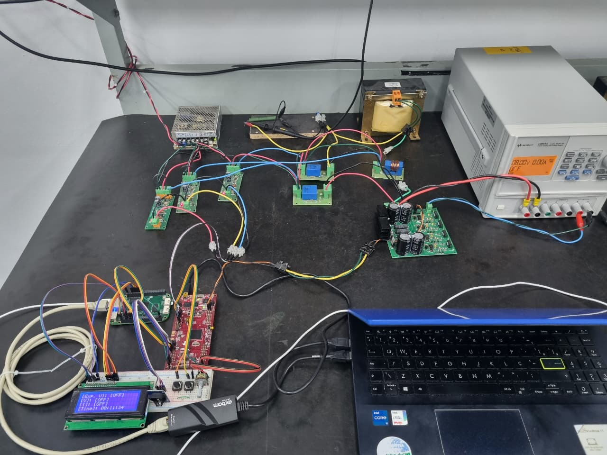
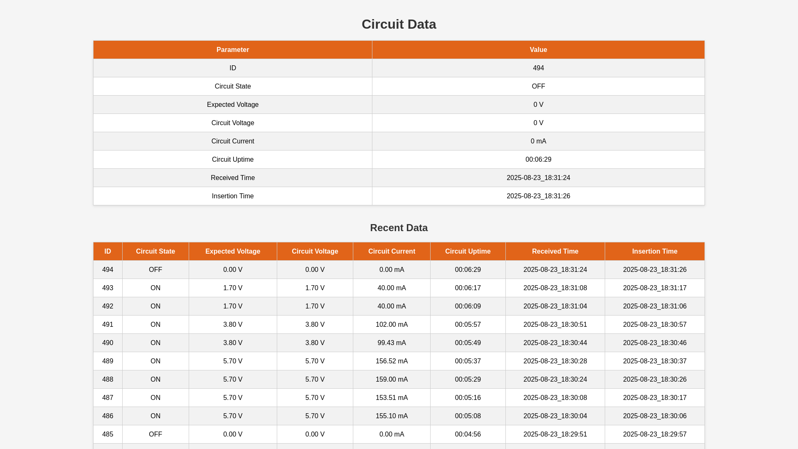

# Scientific Research: Intelligent Buck Converter Control and Monitoring System

This repository contains a comprehensive scientific research project that implements an intelligent buck converter control system with real-time monitoring capabilities. The system consists of two main components that work together to provide advanced power electronics control with neural network and traditional PI controllers, along with comprehensive data acquisition and visualization.

## Project Overview

This research project demonstrates the integration of:
- **Advanced Control Algorithms**: Traditional PI control vs. Neural Network Approximation (NNA)
- **Real-time Data Acquisition**: High-precision voltage and current monitoring
- **Multi-platform Communication**: UART-based data transmission between embedded systems
- **Web-based Monitoring**: Real-time visualization and historical data analysis
- **Database Integration**: Persistent data storage for research analysis

## System Architecture

```
┌─────────────────────────────────────────────────────────────────┐
│                    F28379D LaunchPad (Controller)               │
│  ┌─────────────────┐    ┌──────────────┐    ┌─────────────────┐ │
│  │   PI / Neural   │    │ Buck Circuit │    │  UART Comm.     │ │
│  │   Controller    │────│  Monitoring  │────│  Data Stream    │ │
│  └─────────────────┘    └──────────────┘    └─────────────────┘ │
└─────────────────────────────────────────────────┬───────────────┘
                                                  │ UART Data
                                                  │ Transmission
┌─────────────────────────────────────────────────▼───────────────┐
│               BeagleBone Green (Monitor)                        │
│  ┌─────────────┐  ┌─────────────┐  ┌─────────────┐  ┌─────────┐ │
│  │ UART Input  │  │ LCD Display │  │  SQLite DB  │  │   Web   │ │
│  │ Processing  │──│ Updates     │──│  Storage    │──│  Server │ │
│  └─────────────┘  └─────────────┘  └─────────────┘  └─────────┘ │
└─────────────────────────────────────────────────────────────────┘
```

## Hardware Components

<p align = "middle">
  
</p>

### F28379D LaunchPad Controller
- **TI LAUNCHXL-F28379D** development board
- **Buck Converter Circuit** with voltage/current sensing
- **DS3231 RTC Module** for precise timestamping
- **Control Interface**: Start/Stop buttons and status LEDs
- **Communication**: UART_C for data transmission

### BeagleBone Green Monitor
- **BeagleBone Green** embedded Linux computer
- **20x4 Character LCD** for real-time display
- **UART4 Interface** for receiving controller data
- **Ethernet Connection** for web server access
- **SQLite Database** for data persistence

---

## Project Structure

### [LAUNCHXL_F28379D](./LAUNCHXL_F28379D/) - Buck Converter Controller

The F28379D project implements a sophisticated buck converter control system with dual controller architectures and comprehensive monitoring capabilities.

#### Key Features
- **Dual Controller Support**: Switch between PI and Neural Network controllers
- **Real-time Control Loop**: control cycle with FreeRTOS scheduling
- **High-precision ADC**: 12-bit voltage and current measurements
- **PWM Generation**: 20kHz switching frequency with 2.5%-97.5% duty cycle range
- **Safety Features**: Overvoltage protection, watchdog timer, button controls
- **Communication Protocol**: UART data transmission at 9600 baud

#### Controller Algorithms

##### PI Controller
Traditional discrete-time PI control implementation:
```c
output = (error × b0) + (error_old × b1) - (output_old × a1)
```
- **Tuned Parameters**: `b0 = 0.063288`, `b1 = -0.060934`, `a1 = -1.0`
- **Error Calculation**: `setpoint - measured_voltage`

##### Neural Network Approximator (NNA)
Advanced 3-3-2-1 feedforward neural network with real-time learning:
- **Architecture**: Input(3) → Hidden1(3) → Hidden2(2) → Output(1)
- **Activation**: ReLU functions with clipped output
- **Learning**: Real-time backpropagation with `η = 0.01`
- **Inputs**: Bias(1.0), Normalized Voltage(-1 to +1), Normalized Current(-1 to +1)
- **Weight Initialization**: He initialization for ReLU networks

#### Data Transmission Protocol
```
Active System: SETPOINT,VOLTAGE,CURRENT,HH:MM:SS
Example:       5.2,4.98,0.75,00:01:23

System Off:    OFF,HH:MM:SS
Example:       OFF,00:01:35
```

#### Hardware Configuration
```c
// PWM Output
EPWM1A → Buck Converter MOSFET Driver (20kHz)

// ADC Inputs
ADCB2  → Output Voltage Sensing (0-10V range)
ADCB3  → Load Current Sensing (0-1A range)
ADCA2  → Input Voltage Monitoring
ADCD2  → Setpoint Potentiometer

// GPIO Controls
GPIO67  → START Button (Active Low)
GPIO111 → STOP Button (Active Low)
GPIO31  → Control Status LED
GPIO34  → Communication Status LED

// Communication
UART_C (GPIO56/139) → 9600 baud, 8N1 → BeagleBone Green
I2C_B (GPIO40/41)   → DS3231 RTC Module
```

### [BeagleBone_Green](./BeagleBone_Green/) - Monitoring and Visualization

The BeagleBone Green project provides comprehensive monitoring, visualization, and data logging capabilities for the buck converter system.

#### Key Features
- **Multi-threaded Architecture**: Concurrent UART, LCD, database, and web server operations
- **Real-time Display**: 20x4 LCD showing live circuit status
- **Data Persistence**: SQLite database with automatic insertion
- **Web Interface**: HTTP server for remote monitoring and historical analysis
- **Communication Handler**: UART4 receiver with protocol parsing

#### System Modules

##### UART Communication (`uart.rs`)
- **Port**: `/dev/ttyS4` at 9600 baud
- **Protocol Parser**: Handles both active and OFF state messages
- **Data Structure**: Populates shared `Circuit_Data` structure
- **Timestamping**: Automatic timestamp generation on data reception

##### LCD Display (`lcd_display_impl.rs`)
Real-time 20x4 character display showing:
```
Row 1: Circuit Status (ON/OFF)
Row 2: Expected vs Actual Voltage
Row 3: Current Measurement (mA)
Row 4: System Uptime
```

**GPIO Configuration**:
```rust
RS → GPIO1_03 (/dev/gpiochip1, pin 3)
EN → GPIO1_04 (/dev/gpiochip1, pin 4)
D4 → GPIO0_12 (/dev/gpiochip0, pin 12)
D5 → GPIO3_26 (/dev/gpiochip3, pin 26)
D6 → GPIO0_14 (/dev/gpiochip0, pin 14)
D7 → GPIO1_01 (/dev/gpiochip1, pin 1)
```

##### Database System (`database.rs`)
- **Technology**: SQLite with automatic table creation
- **Storage Interval**: Configurable insertion delay (default: 5 seconds)
- **Schema**: Comprehensive circuit data with dual timestamps
- **Thread Safety**: Arc<Mutex<>> for concurrent access

##### Web Server (`web_server.rs`)
- **Framework**: Axum web framework with async/await
- **Port**: 38534 (accessible on all interfaces)
- **Features**: 
  - Real-time data display
  - Historical data table (last 30 measurements)
  - Responsive HTML interface

#### Data Flow Architecture
```rust
UART Reception → Circuit_Data Structure → {
    ├── LCD Display (2s updates)
    ├── Database Storage (5s intervals)
    └── Web Server (real-time access)
}
```

---

## Getting Started

### Prerequisites
- **F28379D LaunchPad**: Code Composer Studio (CCS) v20+
- **BeagleBone Green**: Rust toolchain, GPIO permissions
- **Hardware**: Buck converter circuit, LCD display, UART connections

### Building and Deployment

#### F28379D Controller
```bash
# Open in Code Composer Studio
# Import existing project: LAUNCHXL_F28379D/F28379D_Project
# Configure controller type in main.c:
# define CONTROLLER 1  // 0=PI, 1=NNA

# Build and flash it to LaunchPad
```

#### BeagleBone Green Monitor
```bash
# Navigate to the main project
cd BeagleBone_Green/src/full_project

# Build project
cargo build

# Run project
cargo run
```

### System Integration
1. **Connect Hardware**: UART cross-connection between boards
2. **Power On**: Start F28379D controller first
3. **Launch Monitor**: Run BeagleBone application
4. **Access Web Interface**: `http://<beaglebone_ip>:38534`

<p align = "middle">
  
</p>

---

## Research Applications

### Control Algorithm Comparison
- **PI vs Neural Network**: Performance analysis under various load conditions
- **Learning Dynamics**: Real-time neural network adaptation
- **Stability Analysis**: Comparative stability margins and transient response

### Data Analytics
- **Historical Trends**: Long-term performance monitoring
- **Efficiency Analysis**: Power conversion efficiency tracking
- **Load Response**: Dynamic load change characterization

### Educational Use Cases
- **Control Theory**: Practical implementation of advanced controllers
- **Embedded Systems**: Multi-platform communication and real-time systems
- **Web Development**: Full-stack monitoring system implementation
- **Database Design**: Time-series data management

---

## Research Highlights

### Novel Contributions
1. **Unified Controller Interface**: Seamless switching between traditional and AI-based control
2. **Real-time Neural Network Training**: On-line learning in embedded power electronics
3. **Multi-platform Integration**: Heterogeneous system communication and monitoring
4. **Comprehensive Data Pipeline**: From sensor to web visualization

### Technical Achievements
- **Control Loop**: High-frequency control with neural network computation
- **Thread-safe Architecture**: Concurrent data access across multiple subsystems
- **Hardware Abstraction**: Modular design enabling easy platform migration
- **Protocol Design**: UART communication with error handling

---

## Performance Metrics

### F28379D Controller
- **ADC Resolution**: 12-bit (4096 levels)
- **PWM Frequency**: 20kHz switching
- **Communication Rate**: 9600 baud UART
- **Neural Network**: 3-3-2-1 architecture with ReLU activation

### BeagleBone Monitor
- **Display Update**: 2-second LCD refresh
- **Database Insertion**: 5-second intervals
- **Web Server**: Real-time HTTP access
- **Data Retention**: Configurable historical storage

---

## License

This project is released under the terms specified in the LICENSE file. The research is conducted for educational and scientific purposes.

---

## 👥 Author

**Gabriel Del Monte**

---

*This project represents a comprehensive approach to modern power electronics control, combining traditional control theory with artificial intelligence, implemented on industrial-grade embedded platforms with full monitoring and data acquisition capabilities.*
